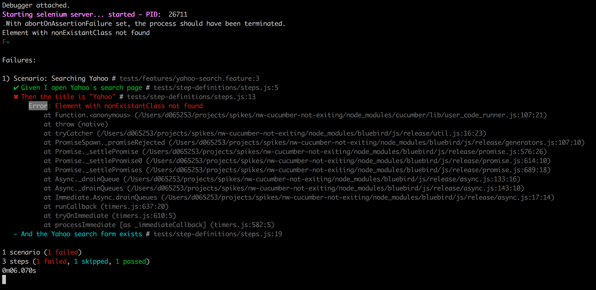
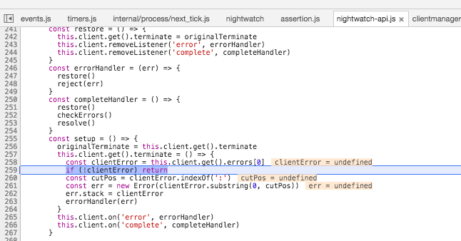

# nighwatch-cucumber not exiting
_It also happens with latest version of cucumber `v3.0.1` and nightwatch-cucumber `v8.0.5`._

nighwatch-cucumber is not exiting after a failure when abortOnAssertionFailure is on

## Run

`nightwatch -c nightwatch-conf.js`

## Issue

Nighwatch does not exit properly. Browser and chromedriver still in execution, even thought an error ocurred.

### Element Not Found Error


### Source code problem


## Describing the issue

Nightwatch produces exceptions that are not necessary catched by listening to Client ["error" & "complete"](https://github.com/mucsi96/nightwatch-cucumber/blob/master/lib/nightwatch-api.js#L264:L265) events.
That prevents the nightwatch api to ends gracefully (closing the selenium/chromedriver).
Examples of exceptions are:
- Socket exceptions, like: not able to create the screenshot
- Trivial exceptions that uses nightwatch/lib/core/assertion.js, like: 
```javascript
  // Given that we set the option abortOnAssertionFailure
  return this.api.element("xpath", `//div[@class='nonExistantClass']`, (result) => {
```

## Possible solution
Between [lines 303-304](https://github.com/mucsi96/nightwatch-cucumber/blob/master/lib/nightwatch-api.js#L303:L304) adding:
```javascript
self.client.get()._originalTerminate = self.client["@client"].terminate;
```
Substitute [line 116](https://github.com/mucsi96/nightwatch-cucumber/blob/master/lib/nightwatch-api.js#L116):
```javascript
// this.client.terminate()
this.client.get()._originalTerminate()
```
This way we ensure that `_closeSession` calls the right nightwatch terminate function.
